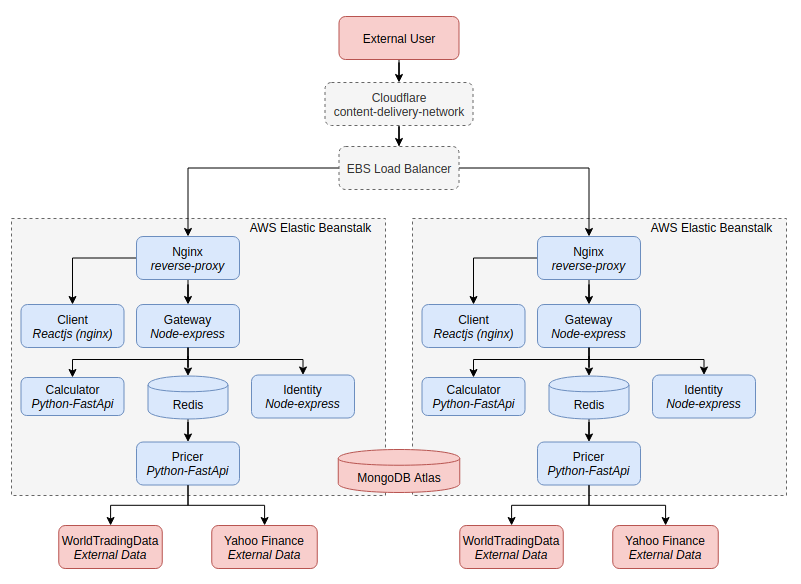

# Stock and Portfolios

Users can select stocks and optimise portfolios through the application of the Modern Portfolio Theory (MPT). The application calculates the volatility and returns of the stocks and portfolios and prices European options based on the Black-Scholes model. The results are plotted in charts in the web client.

The application is available at www.romoclub.com and it uses a React web client, microservices developed with Node (Express) and Python (FastAPI), nginx as a reverse proxy and Redis as a caching layer. The services are deployed in Docker containers in Elastic Beanstalk through Travis CI/CD pipeline.

This platform has been developed for personal educational purposes to apply for a Masters degree. It is not to be considered as investment advice.

## Features:

- Calculation of the volatility and returns of individual stocks and portfolios.
- Optimisation of the portfolio composition by modelling different distributions of the stocks and calculating the Sharpe ratio. 
- Pricing of European Call options.

## Getting Started

You can clone this project and run docker-compose up. See example.env for the environment variables that you need to add manually. The containers can be built with "bash bdev.sh".

## Running the tests

You can run the tests of each service through "npm run test:local" or pytest.

### Break down of testing

- Pytest & Jest: Used for unit testing with mocks for external dependencies.
- Supertest and TestClient: Used for integration testing and API testing that includes external dependencies.

### Services Description

- Calculator: It runs the financial calculations of the stocks and portfolios.
- Pricer: It retrieves the historical data of the stocks.
- Gateway: It is the gateway exposed to the web client that coordinates and aggregates the responses from the microservices.
- Client: This is the web client for the end users and it is served as static content from an nginx server.
- Redis: Caching layer of historical stock data. The data is purged at the end of the day.
- Nginx: It is a reverse proxy that brokers the requests between the Client and Gateway.

## Deployment

This application uses Travis CI to run Continuous Delivery and Integration and the services are deployed in Docker containers in Elastic Beanstalk.

## Built With
- [Nodejs-Express](https://expressjs.com/) - Javascript microservice framework.
- [FastAPI](https://fastapi.tiangolo.com/) - Python microservice framework.
- [React](https://reactjs.org/) - User Interface library.
- [Nginx](https://www.nginx.com/) - Reverse Proxy and web server.
- [Redis](https://redis.io/) - In memory store database.
- [Docker](https://www.docker.com/) - Used to containerize the services.

## Next Steps

- Transition to a websocket connection between the Client and Gateway and utilise a message broker to manage asynchronous requests between the gateway and other services.

## Authors

- **Ignacio Vidal**
